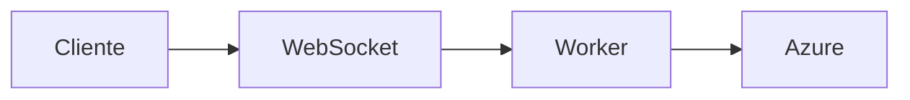

# 📚 Documentação do Projeto

A documentação completa e centralizada do Azure VoiceLive Agent Multi-Tenant está disponível em formato **MkDocs**.

## 🚀 Acessando a Documentação

### Opção 1: Servidor Local (Recomendado)

```bash
# Instale MkDocs (se ainda não instalou)
pip install mkdocs mkdocs-material

# Inicie o servidor de documentação
mkdocs serve
```

Acesse: **http://localhost:8000**

A documentação será atualizada automaticamente conforme você edita os arquivos `.md`.

### Opção 2: Build Estático

```bash
# Gera a documentação estática
mkdocs build

# Arquivos gerados em: site/
# Abra: site/index.html no navegador
```

## 📖 Estrutura da Documentação

```
docs/
├── index.md                        # 🏠 Página inicial
├── quick-start.md                  # ⚡ Início rápido
├── features.md                     # 🎯 Principais features
│
├── multi-tenant/                   # 🌍 Multi-Tenancy (NOVO)
│   ├── overview.md                 # Visão geral da arquitetura
│   ├── websocket-api.md            # API WebSocket detalhada
│   └── supabase-setup.md           # Configuração do Supabase
│
├── configuration/                  # ⚙️ Configuração
│   ├── environment-variables.md    # Variáveis de ambiente
│   ├── agent-config.md             # Config do agente
│   ├── environments.md             # Development/Staging/Production
│   └── client-config.md            # Config por cliente (NOVO)
│
├── development/                    # 👨‍💻 Desenvolvimento
│   ├── guide.md                    # Guia de desenvolvimento
│   ├── architecture.md             # Arquitetura do sistema
│   ├── customization.md            # Pontos de customização
│   └── dependency-injection.md     # Injeção de dependência (NOVO)
│
├── deployment/                     # 🚀 Deploy
│   ├── staging.md                  # Deploy em staging
│   ├── production.md               # Deploy em produção
│   └── docker.md                   # Deploy com Docker
│
├── api/                            # 🔌 API Reference (NOVO)
│   ├── websocket.md                # WebSocket endpoints
│   ├── http.md                     # HTTP endpoints
│   └── errors.md                   # Códigos de erro
│
└── reference/                      # 📚 Referência
    ├── troubleshooting.md          # Solução de problemas
    ├── changelog.md                # Histórico de mudanças (NOVO)
    └── migration-guide.md          # Guia de migração v1→v2 (NOVO)
```

## 📝 Principais Seções

### 🆕 Multi-Tenancy (Novo)
- **[Visão Geral](docs/multi-tenant/overview.md)**: Entenda a arquitetura multi-tenant
- **[WebSocket API](docs/multi-tenant/websocket-api.md)**: Como usar a API WebSocket
- **[Setup Supabase](docs/multi-tenant/supabase-setup.md)**: Configure o banco de dados

### Para Começar
- **[Visão Geral](docs/index.md)**: Introdução ao projeto
- **[Quick Start](docs/quick-start.md)**: Comece em 5 minutos
- **[Features](docs/features.md)**: Conheça todas as funcionalidades

### Configuração
- **[Variáveis de Ambiente](docs/configuration/environment-variables.md)**: Configure credenciais
- **[Agent Config](docs/configuration/agent-config.md)**: Customize o agente
- **[Config por Cliente](docs/configuration/client-config.md)**: Configurações multi-tenant ⭐

### Desenvolvimento
- **[Guia de Desenvolvimento](docs/development/guide.md)**: Comece a desenvolver
- **[Pontos de Customização](docs/development/customization.md)**: Onde e como customizar
- **[Arquitetura](docs/development/architecture.md)**: Entenda a arquitetura
- **[Injeção de Dependência](docs/development/dependency-injection.md)**: Sistema DI ⭐

### Deploy
- **[Deploy Staging](docs/deployment/staging.md)**: Deploy em homologação
- **[Deploy Production](docs/deployment/production.md)**: Deploy em produção
- **[Docker](docs/deployment/docker.md)**: Containerização

### API Reference
- **[WebSocket API](docs/api/websocket.md)**: Documentação completa WebSocket ⭐
- **[HTTP Endpoints](docs/api/http.md)**: Health check e outros endpoints
- **[Códigos de Erro](docs/api/errors.md)**: Referência de erros

## 🎨 Features da Documentação

- ✅ **Busca Integrada**: Busque qualquer conteúdo
- ✅ **Modo Escuro/Claro**: Alternar tema
- ✅ **Navegação por Tabs**: Organização clara
- ✅ **Syntax Highlighting**: Código colorido
- ✅ **Copy Code**: Copie código com um clique
- ✅ **Responsivo**: Funciona em mobile
- ✅ **Diagramas Mermaid**: Visualizações de arquitetura ⭐
- ✅ **Admonitions**: Avisos e dicas destacados

## 🔧 Editando a Documentação

### Adicionando Nova Página

1. Crie arquivo `.md` em `docs/`
2. Adicione ao `mkdocs.yml`:
   ```yaml
   nav:
     - Nova Seção:
       - Página Nova: path/to/page.md
   ```

### Formato Markdown

Use Markdown padrão + extensões do Material:

```markdown
# Título

## Subtítulo

**Negrito** e *itálico*

- Lista
- De
- Itens

```python
# Código com syntax highlighting
def hello():
    print("Hello!")
```

!!! tip "Dica"
    Use admonitions para destacar informações!

!!! warning "Atenção"
    Avisos importantes aqui.

!!! info "Informação"
    Contexto adicional aqui.

## Diagrama Mermaid

```

## 📦 Compartilhando

### Deploy GitHub Pages

```bash
# Configure o repositório GitHub
git remote add origin <url>

# Faça deploy
mkdocs gh-deploy
```

Acesse: `https://youruser.github.io/agent-microsoft/`

### Exportar PDF (Opcional)

```bash
# Instale plugin
pip install mkdocs-with-pdf

# Build com PDF
mkdocs build
```

## 🆕 Novidades na Documentação v2.0

### Novas Seções
- 🌍 **Multi-Tenancy**: Documentação completa da arquitetura multi-tenant
- 🔌 **WebSocket API**: Guia detalhado do endpoint WebSocket
- 🗄️ **Supabase Setup**: Como configurar o banco de dados
- 💉 **Dependency Injection**: Sistema de injeção de dependência
- 📝 **Changelog**: Histórico de versões
- 🔄 **Migration Guide**: Como migrar da v1.x para v2.x

### Melhorias
- ✅ Exemplos de código JavaScript e Python para WebSocket
- ✅ Diagramas de arquitetura atualizados
- ✅ Troubleshooting específico para multi-tenant
- ✅ Referência completa de códigos de erro WebSocket
- ✅ Guias de teste para cada feature

## 🔍 Navegação Rápida

### Por Perfil

**👨‍💻 Desenvolvedor Backend**
1. [Guia de Desenvolvimento](docs/development/guide.md)
2. [Arquitetura](docs/development/architecture.md)
3. [Injeção de Dependência](docs/development/dependency-injection.md)
4. [API WebSocket](docs/api/websocket.md)

**👨‍🎨 Desenvolvedor Frontend**
1. [WebSocket API](docs/multi-tenant/websocket-api.md)
2. [Códigos de Erro](docs/api/errors.md)
3. [Exemplos de Cliente](docs/examples/websocket-clients.md)

**🚀 DevOps**
1. [Deploy Production](docs/deployment/production.md)
2. [Docker](docs/deployment/docker.md)
3. [Variáveis de Ambiente](docs/configuration/environment-variables.md)
4. [Troubleshooting](docs/reference/troubleshooting.md)

**📊 Product Owner**
1. [Visão Geral](docs/index.md)
2. [Features](docs/features.md)
3. [Multi-Tenancy Overview](docs/multi-tenant/overview.md)
4. [Changelog](docs/reference/changelog.md)

## 🤝 Contribuindo

Ao adicionar novas features ou fazer mudanças, lembre de:

1. ✅ Atualizar a documentação relevante
2. ✅ Adicionar exemplos de código funcionais
3. ✅ Incluir troubleshooting se aplicável
4. ✅ Manter consistência de formato
5. ✅ Adicionar diagramas quando necessário
6. ✅ Atualizar o [Changelog](docs/reference/changelog.md)
7. ✅ Revisar links internos

### Checklist para Nova Feature

- [ ] Documentar API (se aplicável)
- [ ] Adicionar exemplos de código
- [ ] Incluir testes
- [ ] Atualizar guia de desenvolvimento
- [ ] Adicionar ao changelog
- [ ] Revisar troubleshooting

---

## 🎯 Links Rápidos

- 📖 [README Principal](README.md)
- 🚀 [Quick Deploy](QUICK_DEPLOY.md)
- 🏗️ [Architecture](ARCHITECTURE.md)
- 📦 [Deploy Easy Panel](DEPLOY_EASYPANEL.md)

---

**🎉 Documentação Completa Multi-Tenant Pronta!**

Use `mkdocs serve` para começar a navegar.

**Novidades v2.0**: Arquitetura multi-tenant com WebSocket, integração Supabase e sistema de injeção de dependência! 🚀
